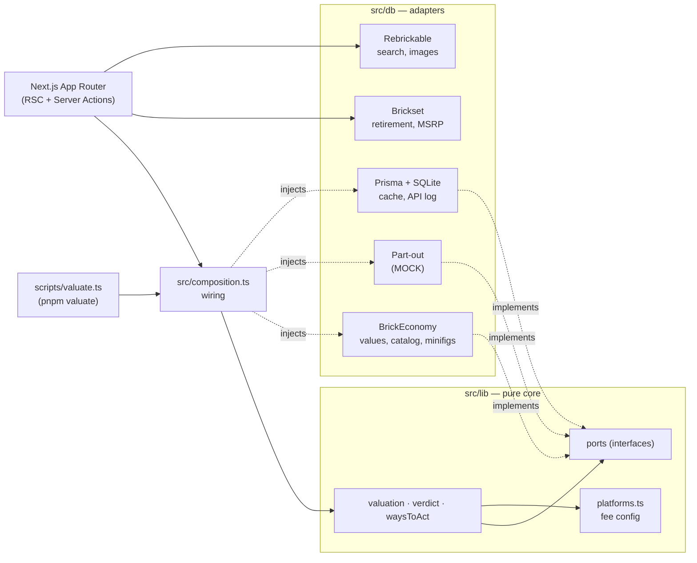

# BasePlate

A local decision tool for LEGO resale: what a set is worth, whether to buy it at a given price, and what to do with it.

## What it does

- **Valuation.** Market value for a set in every condition at once (sealed, open box, used with box, used without box, incomplete), plus 12-month trend and a graded forecast tier.
- **BUY / PASS verdict.** Given a buy price and condition, it picks the best eligible play (flip sealed, resell used, part out), computes the net after fees, and returns BUY only if the margin clears the threshold (default >25%). Every verdict comes with written reasoning.
- **Net after fees per platform.** eBay, Mercari, Facebook (local and shipped), and BrickLink, each with its published fee formula. The verdict is anchored to one venue per play; the others are shown beside it for comparison.
- **Retiring board.** Market-wide list of sets leaving production, with honest date handling (most retirement dates are year/month buckets, and are labelled that way).
- **Minifigs.** Per-figure values, exclusivity, and a minifig-share flag (the "50% rule").

## Screenshots

_Coming soon._

## Design principles

**Honesty over completeness.** The tool informs real money decisions, so it never shows a fabricated, estimated, or stale number as if it were real. Missing data reads "not valued yet", never $0.00. Estimates are flagged, stale values carry a banner, and mock data is labelled MOCK. A blank is better than a confident guess.

**Quota discipline.** BrickEconomy allows 100 requests per day. Rendering, browsing, sorting, and filtering read only from the local cache and never spend a request; only an explicit "Value this set" or "Refresh" click does, one request per set. Every outbound call is logged and shown in a quota meter. Without this, one page of search results could burn the day's allowance.

## Architecture

Ports and adapters. The core in `src/lib/` is pure: no I/O, no Prisma, no adapter imports. It defines interfaces (`ValueProvider`, `PartOutProvider`, `SetCatalogProvider`, `ValuationStore`, `Clock`, and others) and only touches what is injected. Everything that talks to the network or the database lives in `src/db/`. `src/composition.ts` is the one place that decides which implementation backs each port, real or mock.

Fees are config, not code: `src/lib/platforms.ts` holds one row per venue (fee formula, which plays it can host, reach, effort). Adding a platform is an edit to that file.



## Stack

Next.js 16 (App Router), React 19, TypeScript, Tailwind CSS 4, Prisma 6, SQLite. Tests use Node's built-in test runner: **583 tests across 156 suites**, all passing. Dedicated quota tests stub `fetch` and assert that cache reads make no network calls, so the quota rule is enforced by the suite.

## Running locally

Requires Node ≥ 22.18 and pnpm.

```sh
pnpm install
cp .env.example .env   # then add your API keys
pnpm db:push           # create the local SQLite database
pnpm dev               # http://localhost:3000
```

Other commands: `pnpm test`, `pnpm typecheck`, `pnpm valuate` (CLI), `pnpm build` / `pnpm start`.

### API keys (bring your own)

| Provider | Used for | Get a key |
|---|---|---|
| BrickEconomy | Set and minifig values, trend, forecast | https://www.brickeconomy.com |
| Brickset | Retirement dates, availability, MSRP | https://brickset.com/tools/webservices/v3 |
| Rebrickable | Set search by name, images | https://rebrickable.com/api/ |

All provider calls run server-side; no key reaches the browser. `.env.example` documents every variable and optional tunable.

## Status

**Live:** valuation, verdicts, per-platform nets, Lookup, Watchlist, Trending, Retiring board, set detail view, minifig valuation.

**Mock:** part-out value. It needs BrickLink price data and is pending BrickLink API verification. Until then it is labelled MOCK everywhere it appears and never presented as a real quote.

**Roadmap:**
1. Inventory and P&L dashboard: owned sets, made vs. invested, order tracking, retirement calendar.
2. Deals layer: retailer prices (blocked on a data source).
3. Real part-out and a part-out optimizer (blocked on BrickLink).
4. Precedent engine: forecasting from measurable signals, with the historical comparables it reasons from shown.
5. Sourcing / reconstruct optimizer across BrickLink and LEGO Pick-a-Brick.

## License

Copyright © 2026 Pahul Sachdev. All rights reserved.
